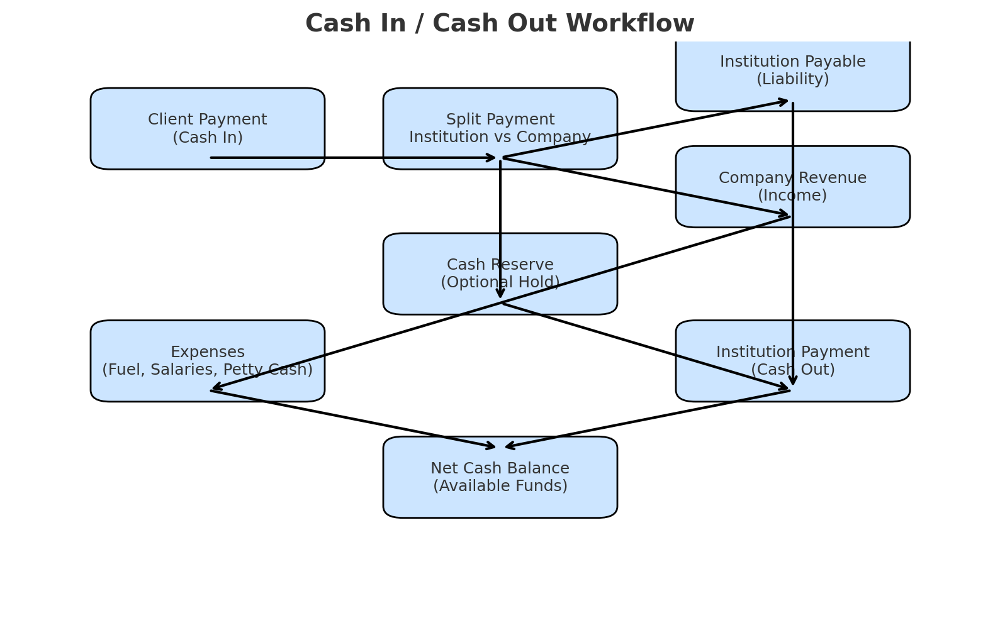

### Company A (Master Branch)

Frontend / bot.js
      |
      v
Django Forwarder (validates X-Bot-Secret)
      |
      v
n8n Webhook Trigger
      |
      v
Secret Validation (Function)
      |
      v
Context Retrieval (Optional)
      |
      v
KB Search (Optional)
      |
      v
LLM Query (Optional)
      |
      v
Fallback Function (if no answer)
      |
      v
Context Update (Optional)
      |
      v
Respond to Webhook -> Django -> Frontend

<!-- 
### Company B (Main Branch)
 -->