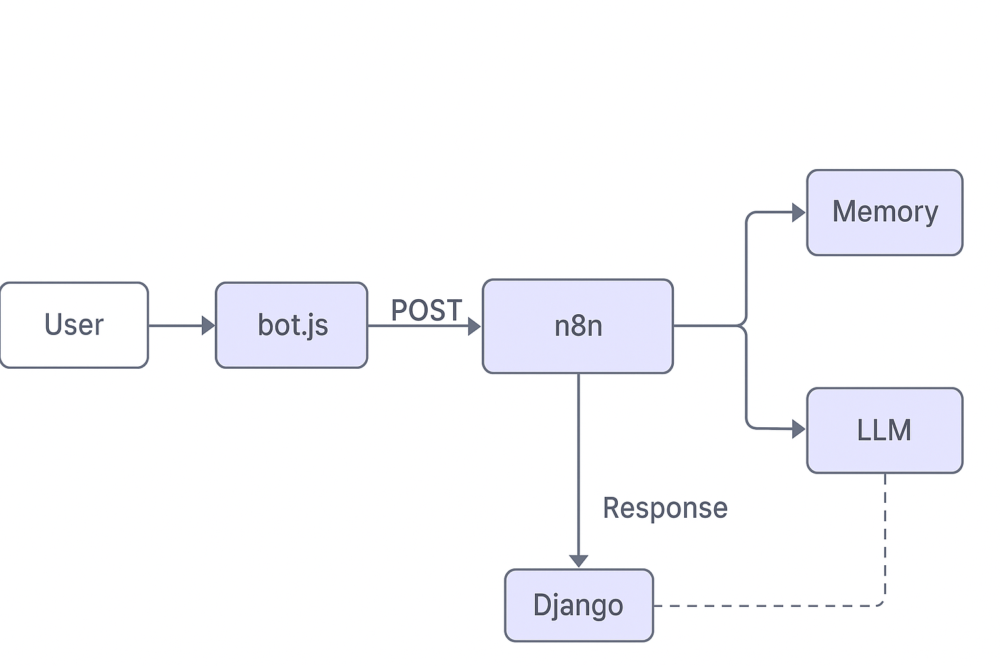
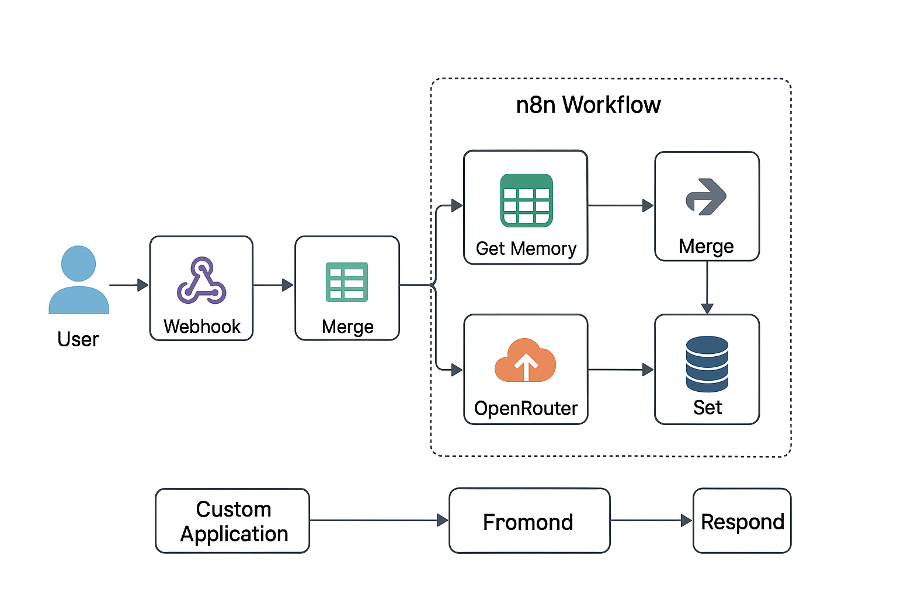

Bot Lifecycle - Secure n8n + Django + Front-end Chat

1️⃣ User Interaction
- User types a message in the web chat.
- bot.js captures message and username.

2️⃣ Front-End Secure Forwarding
- bot.js sends POST request to Django endpoint (/api/bot/forward/)
- Includes header: X-Bot-Secret

3️⃣ Django Forwarder (bot.py)
- Validates secret.
- Parses JSON payload.
- Forwards to n8n webhook securely.
- Returns n8n response back to front-end.

4️⃣ n8n Workflow
- Webhook node receives payload.
- Validate Secret node re-checks header.
- Fetch Memory node loads per-user context from workflow static memory.
- Build LLM Prompt constructs input for OpenRouter.
- OpenRouter LLM generates response.
- Fallback Handler ensures response exists.
- Update Memory saves bot reply back to static workflow memory.
- Respond node completes workflow and returns answer to Django forwarder.

5️⃣ Response to Front-End
- Django forwarder returns JSON with 'answer' to bot.js.
- Front-end displays bot reply in chat UI.

✅ Features
- Secret validation on front-end, forwarder, and n8n.
- Memory using n8n static data (per user).
- LLM fallback ensures human-like reply even if model fails.
- Fully serverless; no external database.

